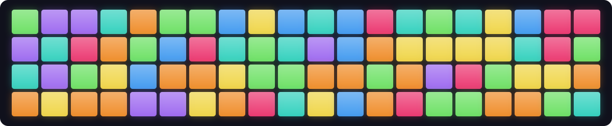

# DiscoFloor



**16 pads. Seven banks. A little disco on your desk.**

DiscoFloor is a Python library and CLI for the **M-Vave SMC PAD Pocket**.
Animate its RGB pads, configure MIDI messages, adjust Note Repeat, and manage
presets. Built from verified Midi Suite SysEx captures, with readable objects,
square-bracket addressing, and context managers that batch updates. Tested
against Pocket firmware v4 and Midi Suite 1.15.0.

## Installation

Requires **Python 3.14+** and [uv](https://docs.astral.sh/uv/).

```sh
git clone https://github.com/krisvandecruys/DiscoFloor.git
cd DiscoFloor
uv sync
```

Connect the Pocket over USB and close Midi Suite before accessing configuration.
DiscoFloor tries `SINCO SMC-PAD Pocket-Private`, then `SMC-PAD Pocket Bluetooth`.
Use `--port "exact name"` to override discovery. Missing ports print the available
MIDI inputs and outputs. Bluetooth configuration SysEx is unverified; listening
over Bluetooth works independently of configuration access.

To use the library in another uv project, install from this checkout:

```sh
uv add '/path/to/DiscoFloor[midi]'
```

The core models have no runtime dependencies. The `midi` extra supplies Mido and
python-rtmidi; this checkout includes them through its default uv groups. Tagged
wheel/source downloads are available under [Releases](https://github.com/krisvandecruys/DiscoFloor/releases).

## Demo

```sh
uv run discofloor demo
```

Seven patterns cycle at **110 BPM**, each for **four bars of 4/4** (16 beats,
about 8.7 seconds). One complete cycle is 28 bars, about 61 seconds, then repeats.
They are disco-inspired geometric patterns rather than a reconstruction of a
specific historical floor program.

| Pattern | Movement |
| --- | --- |
| Color shuffle | Original demo: odd pads change on beats 1/3, even pads on 2/4 |
| Checkerboard | Two interlocking groups swap colors each beat |
| Candy stripes | Four colored columns march sideways |
| Row chase | A bright row sweeps bottom to top |
| Diagonal wave | Rainbow bands travel diagonally |
| Perimeter spin | A bright comet circles the twelve outer pads |
| Center pulse | Center tiles and outer ring pulse in opposition |

Each beat uses one bank update. The terminal announces each pattern. The demo
snapshots the original bank and restores it on completion, Ctrl-C, or an exception.
It never saves to flash. Keep the device connected during cleanup; a process
kill or power loss cannot run restoration.

```sh
uv run discofloor demo --bpm 128 --preset 1 --bank 3
uv run discofloor demo --dry-run --frames 8  # Preview without MIDI access.
```

| Option | Purpose |
| --- | --- |
| `--bpm` | Animation speed; default 110, independent of device Note Repeat tempo |
| `--preset`, `--bank` | Target; defaults 1 and 3 |
| `--seed` | Reproducible colors |
| `--frames` | Stop after this many beats |
| `--dry-run` | Preview without opening MIDI ports |
| `--port` | Override MIDI port discovery |

## CLI

```sh
uv run discofloor --help
uv run discofloor pad --help
uv run discofloor note-repeat --help
uv run discofloor globe --help
uv run discofloor preset --help
```

Settings follow the app's sections. Numbers for pads, banks, presets and MIDI
channels are **one based**. Pad ranges accept `1-4,7,9-12`; `1-16` means all pads.
Every command accepts `--help` and `--port`, with the latter also available before
the subcommand. Boolean flags use `--aftertouch` / `--no-aftertouch`, `--sync` /
`--no-sync`, and `--latch` / `--no-latch`. Omitted flags leave settings unchanged.

### Pad

```sh
uv run discofloor pad 1-4                         # Inspect settings.
uv run discofloor pad 1-16 --color ffaa99
uv run discofloor pad 5 --note 60 --channel 10
uv run discofloor pad 1-4 --min-velocity 10 --max-velocity 127
uv run discofloor pad 6 --cc 74 --momentary --on 127 --off 0
uv run discofloor pad 7 --program 12 --bank-msb 0 --bank-lsb 1
uv run discofloor pad 8 --custom 'f0 7d 01 f7'
uv run discofloor pad 9 --control note-repeat      # Control mode across all banks.
uv run discofloor pad 9 --mode pad                 # Return to normal pad mode.
```

| Options | Meaning |
| --- | --- |
| `--color`, `--brightness` | RGB hex; brightness 0–255 |
| `--note`, `--channel` | Note 0–127; channel 1–16 |
| `--min-velocity`, `--max-velocity` | Note velocity bounds 0–127 |
| `--cc`, `--momentary`, `--on`, `--off` | Toggle or momentary CC; defaults on=127, off=0 |
| `--program`, `--bank-msb`, `--bank-lsb` | Program change and bank selection; bank defaults 0 |
| `--custom` | 1–16 hex bytes, stored as the pad's custom payload |
| `--mode`, `--control` | Pad/Control mode and assigned function |
| `--preset`, `--bank` | Address settings without changing visible selection |

Choose one message type: Note, CC, Program or Custom. Type changes preserve
channel unless supplied; `--note` preserves velocity bounds and assigns the
same note to each selected pad. Invalid bounds abort the bank edit. Color and
message changes are batched into one bank write. Quote `#`-prefixed colors.

Control functions are `note-repeat`, `rate-up`, `rate-down`, `swing-up`,
`swing-down`, `bank-up`, `bank-down`, and `latch`. `--control` implies Control
mode and overrides the underlying MIDI message for that physical pad across
all banks of the preset. Combining control assignments with bank edits sends
separate writes. A custom payload is stored, not sent as a standalone message.

### Note Repeat

```sh
uv run discofloor note-repeat
uv run discofloor note-repeat --tempo 110 --time 1/16 --swing 50
uv run discofloor note-repeat --sync --no-latch
```

These settings are independent of presets and **volatile**, including after
Save. `--time` accepts `1/4`, `1/4T`, `1/8`, `1/8T`, `1/16`, `1/16T`, `1/32`,
`1/32T`; T means triplet. Swing is 0–100%. Tempo accepts positive 16-bit values;
firmware limits are unmeasured. Sync follows an external clock; Latch continues
repetition after release. Activate Note Repeat using an assigned physical
control pad; direct protocol activation and clock output remain unverified.

### Globe

```sh
uv run discofloor globe
uv run discofloor globe --bank 3 --curve 4 --aftertouch
uv run discofloor globe --preset 2 --no-aftertouch
uv run discofloor globe --calibration 3 --pads 1-4  # Persists immediately.
uv run discofloor globe --snapshot bank.json
uv run discofloor globe --restore bank.json
```

The app calls this section Globe, but bank, curve and aftertouch are **per
preset**. `--preset` addresses a slot without selecting it; default is active.
Curve 4 produces full velocity; curves 1–3 have not been characterized.

Calibration applies to physical pads, independent of presets and banks. Level
**1 is most sensitive; 8 is least sensitive**. Increasing it helps prevent
unintended double triggers. Supply `--calibration LEVEL --pads RANGE` alone;
it persists immediately. Unknown calibration values are preserved.

Snapshots contain the bank's 416 pad bytes, its preset's selected bank, and the
active preset selection. `--snapshot` defaults to the selected bank; `--bank`
can address another bank without selecting it. Restore reinstates saved bytes
and selections. Snapshots exclude controls, curve, aftertouch, calibration and
other Note Repeat settings; neither operation implicitly saves.

### Preset

```sh
uv run discofloor preset                          # Read active slot.
uv run discofloor preset 2                        # Select slot 2.
uv run discofloor preset --export backup.spp
uv run discofloor preset 2 --import backup.spp
uv run discofloor preset --reset                   # Only the active preset.
uv run discofloor preset --reset-all               # App-style full reset.
uv run discofloor preset --save
```

An optional number selects a preset before its action. Choose one action per
invocation. Import/export uses complete 2931-byte `.spp` files. Reset restores
the active slot's captured factory settings; full reset replaces all four slots,
resets Note Repeat settings, and selects preset 1. Neither touches calibration.

**Save commits preset changes across all four slots.** Import, reset and other
preset edits do not automatically Save. Note Repeat settings remain volatile;
calibration uses its own immediate persistent commit.

### Inspect and listen

```sh
uv run discofloor show
uv run discofloor listen
uv run discofloor listen --port 'SMC-PAD Pocket Bluetooth'
uv run discofloor listen --preset-file backup.spp --bank 3
uv run discofloor protocol ports
```

`show` describes active-bank configured messages; `listen` reports incoming
strikes/releases. Listening prefers USB Master, then Bluetooth. It reads a
mapping through USB Private when available. Bluetooth listening sends no SysEx;
provide `--preset-file` for mapping, otherwise it reports raw MIDI with “Pad
unknown”. `--bank` requires a preset file. Duplicate assignments list every
candidate; Control pads may act internally without emitting MIDI. Restart
after changing selection or configuration. Ctrl-C stops listening.

Low-level `protocol` tools generate/decode packets. They default to dry-run;
sending requires explicit `--send --port`. Run `protocol --help` for details.

### Launcher

Turn notes into command launches. Put the chosen executable and its arguments
**after `--`**:

```sh
uv run discofloor launcher --note 36 -- open -a Music
uv run discofloor launcher --note 36 --channel 10 --min-velocity 90 -- open -a Music
uv run discofloor launcher --note 36 --event note-off -- printf 'Released note %s\n' '{note}'
uv run discofloor launcher --note 36 --event both --allow-overlap -- printf '%s: %s\n' '{event}' '{velocity}'
uv run discofloor launcher --cc 74 --value 127 -- open -a Music
uv run discofloor launcher --program 7 -- open -a Music
uv run discofloor launcher --config examples/launcher.toml --dry-run
```

`--event` accepts `note-on` (default), `note-off`, or `both`. Note On with velocity
zero counts as Note Off. `--velocity` selects an exact velocity; `--min-velocity`
and `--max-velocity` set inclusive bounds (default 0–127), including release
velocity. Channels are 1–16; omitting `--channel` matches any channel. Note/CC/
program numbers are 0–127. CC `--value` is optional; without it all values match.

Listening uses the performance input, like `listen`, and sends no MIDI or
configuration messages. `--dry-run` listens and prints matched commands without
executing them. By default a binding skips triggers while its command is still
running; `--allow-overlap` allows concurrent instances. There is no cooldown by
default; `--cooldown SECONDS` adds one per binding. Both-event bindings may need
`--allow-overlap` to launch on a quick release while the press command is busy.
**Ctrl-C stops listening; launched commands keep running.** Child output appears
in the same terminal, and nonzero exits are reported.

Multiple bindings live in a TOML file:

```toml
[[binding]]
note = 36
channel = 10
event = "note-on"
command = ["open", "-a", "Music"]

[[binding]]
note = 36
channel = 10
event = "note-off"
command = ["printf", "Released note %s\n", "{note}"]

[[binding]]
cc = 74
value = 127
command = ["open", "-a", "Safari"]
```

Run it with `uv run discofloor launcher --config launcher.toml`. Optional
binding keys are `velocity`, `min_velocity`, `max_velocity`, `cooldown`,
`allow_overlap`, and `cwd`. A relative `cwd` is relative to the TOML file;
otherwise commands inherit the launcher's working directory. An optional
root `port` chooses the input; CLI `--port` overrides it. Every binding must
have exactly one `note`, `cc`, or `program` and a `command` argument array.
Overlapping bindings all run independently.

Arguments can contain `{note}`, `{velocity}`, `{channel}`, `{control}`, `{value}`,
`{program}`, and `{event}`. Channel placeholders are one based; `{event}` is
normalized to `note-on` / `note-off` for notes. Other events use their MIDI type.
Fields absent from an event become 0. Commands run as argument lists with no
implicit shell expansion or parsing. If shell features are needed, explicitly
choose a shell command such as `sh -c`.

Migration from older CLI names: `bank` → `globe --bank`, `runtime` →
`note-repeat`, `save` → `preset --save`, and color/fill → `pad RANGE --color`.

## API

The live Python API follows the same four sections: `device.pad`,
`device.note_repeat`, `device.globe`, and `device.preset`.
Constructing `Pocket()` opens no ports. Live getters read the device; setters
and successful edit blocks communicate over MIDI. All writes wait for an ACK
and never retry automatically. Close Midi Suite first.

### Pad colors and messages

```python
from discofloor import Color, Control, Pocket

device = Pocket()  # Or Pocket("exact MIDI port name").
device.pad[1, 3, 5].color = Color.from_hex("#ff0044")

current_bank = device.preset[1].bank[3]
with current_bank.edit() as bank:
    for i in range(1, 17):
        bank.pad[i].color = Color.from_hex("#ffaa99")
    bank.pad[5].note(60, channel=10, min_velocity=10, max_velocity=127)

# A single-pad edit also stages and sends its bank once.
with device.pad[1, 3, 6].edit() as pad:
    pad.cc(74, channel=10, on=127, off=0, momentary=True)
    pad.brightness = 200

# Control assignments affect this physical pad across the preset's banks.
device.pad[1, 3, 9].control = Control.NOTE_REPEAT
device.pad[1, 3, 9].mode = "pad"  # Remove the control assignment.
```

Live color assignment sends one immediate three-byte color write. Live color is
write-only; read colors within a bank/pad edit or through a preset read.
Live pads also expose `channel`, `brightness`, `control`, and `mode`, plus
`note()`, `cc()`, `program()`, and `custom()`. `PadId(preset, bank, pad)` can be
used instead of a tuple. Control assignments are outside bank edit blocks.

Bank/pad edit blocks read a bank and send one 416-byte update when changed.
Exceptions and unchanged blocks send no write. Unknown fields survive. One
packet reduces the visible sweep; simultaneous firmware LED refresh is not
guaranteed. The addressed preset and bank must be active to see their colors.

### Note Repeat

```python
device.note_repeat.tempo = 110
device.note_repeat.time = "1/16"

with device.note_repeat.edit() as repeat:
    repeat.tempo = 110
    repeat.time = "1/16T"
    repeat.swing = 50
    repeat.sync = False
    repeat.latch = True

settings = device.note_repeat.read()
print(settings.tempo, settings.time)
```

`read()` returns a `NoteRepeatSettings` snapshot. Direct getters/setters use
MIDI; an edit block reads once and sends one runtime update when changed.
`configure(tempo=110, time="1/16", sync=False)` is a shorthand for one edit block.
Time accepts subdivision strings or `RepeatRate` enum values. Active preset and
unknown runtime bytes are preserved. These settings do not persist with Save.

### Globe

```python
device.globe.aftertouch = True  # Active preset.

with device.globe[2].edit() as globe:  # Slot 2, without selecting it.
    globe.bank = 3
    globe.curve = 4
    globe.aftertouch = False

settings = device.globe[2].read()
device.globe.calibrate([1, 2, 3, 4], level=3)  # Immediately persists.
record = device.globe.calibration(1)  # Read physical-pad calibration.
```

Globe exposes `bank`, `curve`, and `aftertouch`. Its edit block sends one
three-byte settings update when changed. `configure()` accepts the same fields.
`device.preset[2].globe` is equivalent to `device.globe[2]`. Calibration remains
physical-pad-wide regardless of the view's preset; all requested pad numbers
are validated before calibration writes start.

```python
snapshot = device.globe[1].snapshot(bank=3)
try:
    device.pad[1, 3, 1].color = Color(0, 255, 0)
finally:
    snapshot.restore()
```

Snapshot contents and cleanup limits are the same as described under CLI Globe.
The existing `device.preset[1].bank[3].snapshot()` also remains available.

### Presets and files

```python
device.preset.active = 2
print(device.preset.active)
device.preset[2].export("backup.spp")
device.preset[2].import_file("backup.spp")
device.preset[2].reset()
device.preset.save()  # Explicit persistence across ALL slots.

# App-style full reset, without Save:
# device.preset.reset_all()
```

Indexed preset operations address that slot **without selecting it**; use
`device.preset.active = 2` or `device.preset[2].select()` to select. Collection
`export()`, `import_file()`, and `reset()` use the active slot. `reset_all()`
reproduces all captured app reset writes. Save always commits across slots,
even if called as `device.preset[2].save()`.

For offline editing, use a lossless local `Preset` model:

```python
from discofloor import Color, Control, Preset

preset = Preset.load("backup.spp")
preset.bank[3].pad[1].color = Color.from_hex("#ff8000")
preset.bank[3].pad[1].note(36, channel=10)
preset.assign_control(16, Control.LATCH)
preset.globe.bank = 3
preset.globe.curve = 2
preset.globe.aftertouch = True
preset.export("edited.spp")

device.preset[2].upload(preset)  # Full upload; no implicit Save.
```

`device.preset[2].read()` returns a local model. Local assignments only edit
memory. `Preset.copy()` makes an independent copy; `to_bytes()` retains unknown
fields. `messages(slot=2)` generates changed-byte writes; full `upload()` is
safer when device state is unknown. Legacy `device.apply_changes(preset, slot=2)`
assumes the device shares the model's original baseline. Existing methods
`save()`, `select_preset()`, `upload()`, `set_repeat_rate()`, and `calibrate()`
and local `active_bank`, `velocity_curve`, `aftertouch` properties remain
compatible. Callable bank/pad indexing also remains supported.

### Launcher bindings

The same launcher is available to Python scripts:

```python
from discofloor.launcher import Binding, Launcher, Trigger

bindings = [
    Binding(Trigger("note", 36, channel=10, event="note-on"), ("open", "-a", "Music")),
    Binding(
        Trigger("note", 36, channel=10, event="note-off"), ("printf", "Released %s\n", "{note}")
    ),
]
Launcher(bindings, dry_run=True).run()  # Listen and preview; no commands executed.
```

`Launcher.run()` listens until interrupted. It opens only the MIDI input and
lets `KeyboardInterrupt` propagate to the caller. Binding options include
`cooldown`, `allow_overlap`, and a `Path` working directory; their behavior
matches the CLI. `load_config(Path("launcher.toml"))` returns bindings and the
optional configured port.

### Protocol and development

See [the protocol reference](docs/PROTOCOL.md) for packet mappings, captures,
persistence tests and unresolved fields. The larger SMC PAD model is untested.
Python color writes were tested live; upload, Save and reset have capture-level
validation. App persistence was checked across power cycles. Runtime byte 6
and four calibration values remain unexplained and are preserved.

```sh
uv run python -m unittest discover -s tests -v
uv run ruff check .
uv run ruff format --check .
uv run ty check
uv build
```

Tests require no hardware. Compact evidence is under `tests/fixtures`; full
research sessions and personal backups remain outside the repo. The reset
configuration is reconstructed as readable parameters and checked against
captured packets. Vendor firmware assets are not distributed.

[MIT](LICENSE) licensed. Independent project; not affiliated with M-Vave.
